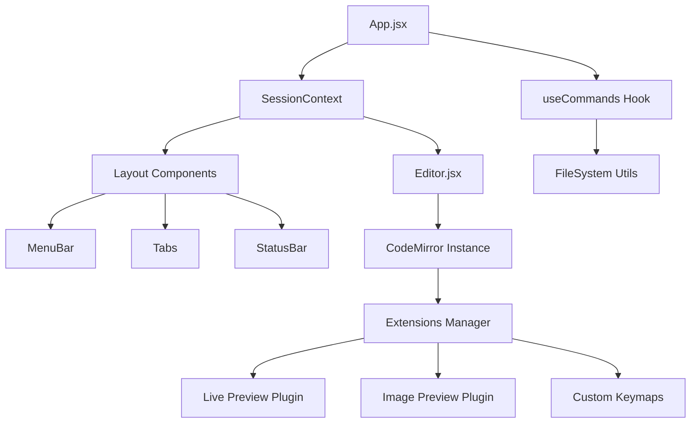

# Architecture Design Document

**Project:** Notepad Flux  
**Last Updated:** 2025-12-11

---

## 1. Introduction

This document outlines the architectural design of **Notepad Flux**, a lightweight, markdown-focused text editor inspired by Windows Notepad but enhanced with modern "Live Preview" capabilities similar to Obsidian.md.

---

## 2. System Overview

The application is a Single Page Application (SPA) built with **React** and **Vite**, utilizing **CodeMirror 6** as the core text editing engine. It is designed to run in modern web browsers with planned support for desktop packaging via Electron.

### Key Technologies

- **Frontend Framework**: React 18+
- **Build Tool**: Vite
- **Editor Engine**: CodeMirror 6 (@codemirror/view, @codemirror/state, @codemirror/language)
- **Styling**: CSS Modules + Global CSS Variables
- **Icons**: Lucide React

---

## 3. High-Level Architecture

The application follows a component-based architecture where the state is managed centrally via React Context (`SessionContext`) and specific editor logic is encapsulated within CodeMirror extensions.



---

## 4. Directory Structure

```
src/
├── components/         # React UI Components
│   ├── Layout/         # UI Shell (MenuBar, Tabs, StatusBar, etc.)
│   └── Editor.jsx      # Wrapper around CodeMirror instance
├── context/            # React Context for global state
│   └── SessionContext  # Manages tabs, active file, and session data
├── extensions/         # CodeMirror 6 Extensions (The "Brain" of the editor)
│   ├── livePreview.js  # Core WYSIWYG logic (syntax hiding/revealing)
│   ├── widgets.js      # Custom DOM widgets (Checkboxes, Tables, HR)
│   ├── imagePreview.js # Inline image rendering
│   └── ...
├── hooks/              # Custom React Hooks
│   └── useCommands.js  # Centralized command logic (Save, Open, New Tab)
├── styles/             # Global styles and CSS variables
├── utils/              # Utility functions
│   └── fileSystem.js   # Abstraction for File System Access API
├── App.jsx             # Main application layout and event wiring
└── main.jsx            # Entry point
```

---

## 5. Core Modules & Logic Flow

### 5.1. Session Management (`SessionContext`)

**Responsibility**: Manages the state of open files (tabs).

- **State**:
  - `tabs`: Array of open file objects `{ id, title, content, fileHandle, isDirty }`.
  - `activeTabId`: ID of the currently visible tab.
  - `recentFiles`: History of recently opened files.

- **Logic**: Provides methods to `createTab`, `closeTab`, `updateTab`, and `switchTab`. It acts as the single source of truth for *what* is open, but not necessarily the *current editor state* (which lives in CodeMirror).

### 5.2. The Editor Engine (`Editor.jsx` & CodeMirror)

**Responsibility**: Handles text editing, rendering, and syntax highlighting.

- **Initialization**: `Editor.jsx` initializes a CodeMirror `EditorView` when a tab becomes active.

- **State Sync**:
  - When the user types, `Editor.jsx` captures changes and updates the `SessionContext` (marking the tab as "dirty").
  - When the active tab changes, `Editor.jsx` saves the current view state (scroll position, history) to a cache and restores the state for the new tab.

### 5.3. Live Preview System (`extensions/livePreview.js`)

**Responsibility**: Implements the "WYSIWYG" feel where markdown syntax is hidden unless the cursor is on it.

- **Mechanism**:
  - Uses a CodeMirror `ViewPlugin` and `StateField`.
  - **`buildDecorations`**: Scans the document for markdown syntax (Bold, Italic, Headings, etc.).
  - **Cursor Detection**: Checks if the user's cursor (`state.selection`) overlaps with a syntax node.
    - **If Overlap**: Renders raw text (reveals syntax).
    - **If No Overlap**: Replaces syntax with styled `Decoration` (e.g., hides `**`, makes text bold) or replaces the node with a `Widget` (e.g., Checkbox, Horizontal Rule).

- **Widgets**:
  - `CheckboxWidget`: Interactive checkbox that updates the underlying text `[ ]` <-> `[x]` on click.
  - `TableWidget`: Renders a complex HTML table from markdown table syntax.
  - `ImageWidget`: Renders images inline.

### 5.4. File System Abstraction (`utils/fileSystem.js`)

**Responsibility**: Handles reading and writing files to the user's disk.

- **Strategy**:
  - **Primary**: Uses the modern **File System Access API** (`showOpenFilePicker`, `showSaveFilePicker`) for direct read/write access.
  - **Fallback**: Uses standard HTML `<input type="file">` and `<a>` download attributes for browsers that don't support the API (e.g., Firefox).

### 5.5. Command System (`hooks/useCommands.js`)

**Responsibility**: Bridges the UI (MenuBar, Shortcuts) with the Logic (Context, FileSystem).

- **Flow**:
  1. User clicks "Save" or presses `Ctrl+S`.
  2. `useCommands.saveFile` is triggered.
  3. It checks `SessionContext` for the active tab's `fileHandle`.
  4. If a handle exists, it calls `fileSystem.saveFile`.
  5. If successful, it calls `session.updateTab` to clear the `isDirty` flag.

---

## 6. Data Flow Scenarios

### Scenario A: Opening a File

1. **User Action**: Click "Open" in MenuBar.
2. **Command**: `useCommands.openFile()` calls `fileSystem.openFile()`.
3. **File System**: Browser native picker opens -> User selects file -> Returns `{ handle, content, name }`.
4. **Context Update**: `useCommands` calls `session.createTab()` with the new file data.
5. **Editor Update**: `Editor.jsx` detects `activeTabId` change -> Initializes new CodeMirror instance with `content`.

### Scenario B: Editing and Live Preview

1. **User Action**: User types `**Bold**`.
2. **CodeMirror**:
   - Updates internal document state.
   - `livePreview.js` plugin runs `update()`.
   - Detects cursor is *inside* the range.
   - **Render**: Shows `**Bold**` (raw text).
3. **User Action**: User moves cursor away.
4. **CodeMirror**:
   - `livePreview.js` runs `update()`.
   - Detects cursor is *outside*.
   - **Render**: Hides `**`, applies `font-weight: bold` style to "Bold".

---

## 7. Performance & Scalability

### 7.1. Large Session Handling Strategy

**Scale**: High number of tabs (N > 50) or large total session size (>100MB).

**Risks**: Slow application startup, high memory usage (GC pressure), and UI responsiveness issues if all tabs are fully initialized at once.

### 7.2. Mitigation Architecture

#### Light Domain State

The global `SessionContext` is designed to be lightweight:
- **Storage**: Stores only raw text and minimal metadata (file path, dirty status).
- **Avoidance**: Derived structures like ASTs, render caches, or editor view states are excluded from the global state.
- **On-Demand Computation**: Individual editor instances recompute these derived states only when they are initialized or become active.

#### Progressive Session Loading

To optimize startup performance:
1. **Active Tab Priority**: The content of the active tab is loaded and rendered immediately upon startup.
2. **Background Hydration**: Inactive tabs are loaded lazily or "hydrated" in the background using `requestIdleCallback` or low-priority timers.
3. **UI Responsiveness**: The UI shell renders first, ensuring the application feels responsive even if the full session data is still loading in the background.

### 7.3. Large File Handling

CodeMirror 6 is performant, but the `livePreview` regex parsing might need optimization for very large documents:
- **Current**: Regex-based parsing for markdown syntax.
- **Future**: Consider using a proper Lezer parser for better performance with files >10,000 lines.

---

## 8. Future Considerations

### 8.1. Electron Integration

The current architecture is "Electron-ready":
- The `fileSystem.js` module can be extended to use Node.js `fs` module when running in an Electron context.
- Allows for deeper OS integration (native menus, file associations, window management).

### 8.2. Plugin System

The architecture allows for easy addition of new features by simply adding new CodeMirror extensions:
- Extensions are modular and can be enabled/disabled independently.
- Custom extensions can be added to the `extensions/` array in `Editor.jsx`.

---

## 9. Security Considerations

### 9.1. File System Access

- **Permissions**: File System Access API requires explicit user permission for each file/directory.
- **Sandboxing**: Browser security model prevents unauthorized file access.

### 9.2. Content Rendering

- **XSS Prevention**: All user-generated content is rendered through CodeMirror's safe DOM manipulation.
- **Link Safety**: External links open in new tabs with `rel="noopener noreferrer"`.

### 9.3. Local Storage

- **Session Data**: Stored in browser's IndexedDB (origin-isolated).
- **Privacy**: No data is sent to external servers; all processing is client-side.

---

## 10. Extension Architecture

### Core Extensions

The editor's functionality is built through composable CodeMirror extensions:

1. **`livePreview.js`**: Main live preview logic
   - Handles syntax hiding/revealing
   - Manages decorations for all markdown elements
   - Implements activation modes

2. **`widgets.js`**: Widget definitions
   - `BulletWidget`: Bullet point replacement
   - `CheckboxWidget`: Interactive task checkbox
   - `HRWidget`: Horizontal rule
   - `TableWidget`: Rendered table

3. **`imagePreview.js`**: Image rendering
   - Image loading and caching
   - Broken image handling
   - Active/inactive state management

4. **`linkPreview.js`**: Link rendering
   - Link widget with icon
   - Markdown parsing in link text
   - Cursor-based activation

5. **`linkHandler.js`**: Link interaction
   - Ctrl+Click to open links
   - Hover tooltip
   - URL extraction from syntax tree

6. **`listKeymap.js`**: List keyboard behaviors
   - Enter key handling
   - Tab/Shift+Tab indentation
   - Task list creation

---

*This document is maintained alongside the codebase and should be updated when significant architectural changes are made.*
