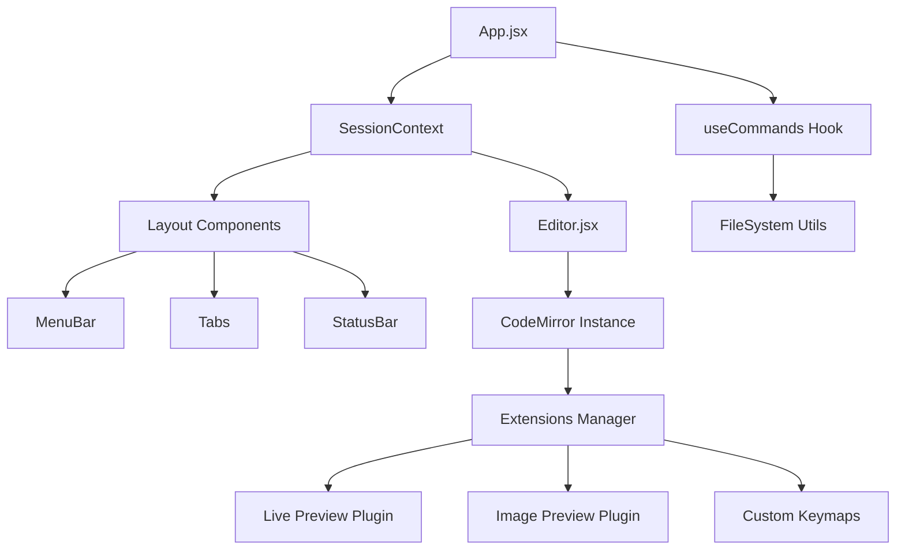

# Architecture Design Document (ADD) - Notepad Obsidian

## 1. Introduction
This document outlines the architectural design of **Notepad Obsidian**, a lightweight, markdown-focused text editor inspired by Windows Notepad but enhanced with modern "Live Preview" capabilities similar to Obsidian.md.

## 2. System Overview
The application is a Single Page Application (SPA) built with **React** and **Vite**, utilizing **CodeMirror 6** as the core text editing engine. It is designed to run in modern web browsers with planned support for desktop packaging via Electron.

### Key Technologies
- **Frontend Framework**: React 18+
- **Build Tool**: Vite
- **Editor Engine**: CodeMirror 6 (@codemirror/view, @codemirror/state, @codemirror/language)
- **Styling**: CSS Modules + Global CSS Variables
- **Icons**: Lucide React

## 3. High-Level Architecture

The application follows a component-based architecture where the state is managed centrally via React Context (`SessionContext`) and specific editor logic is encapsulated within CodeMirror extensions.



## 4. Directory Structure

```
src/
├── components/         # React UI Components
│   ├── Layout/         # UI Shell (MenuBar, Tabs, StatusBar, etc.)
│   └── Editor.jsx      # Wrapper around CodeMirror instance
├── context/            # React Context for global state
│   └── SessionContext  # Manages tabs, active file, and session data
├── extensions/         # CodeMirror 6 Extensions (The "Brain" of the editor)
│   ├── livePreview.js  # Core WYSIWYG logic (syntax hiding/revealing)
│   ├── widgets.js      # Custom DOM widgets (Checkboxes, Tables, HR)
│   ├── imagePreview.js # Inline image rendering
│   └── ...
├── hooks/              # Custom React Hooks
│   └── useCommands.js  # Centralized command logic (Save, Open, New Tab)
├── styles/             # Global styles and CSS variables
├── utils/              # Utility functions
│   └── fileSystem.js   # Abstraction for File System Access API
├── App.jsx             # Main application layout and event wiring
└── main.jsx            # Entry point
```

## 5. Core Modules & Logic Flow

### 5.1. Session Management (`SessionContext`)
**Responsibility**: Manages the state of open files (tabs).
- **State**:
  - `tabs`: Array of open file objects `{ id, title, content, fileHandle, isDirty }`.
  - `activeTabId`: ID of the currently visible tab.
  - `recentFiles`: History of recently opened files.
- **Logic**: Provides methods to `createTab`, `closeTab`, `updateTab`, and `switchTab`. It acts as the single source of truth for *what* is open, but not necessarily the *current editor state* (which lives in CodeMirror).

### 5.2. The Editor Engine (`Editor.jsx` & CodeMirror)
**Responsibility**: Handles text editing, rendering, and syntax highlighting.
- **Initialization**: `Editor.jsx` initializes a CodeMirror `EditorView` when a tab becomes active.
- **State Sync**:
  - When the user types, `Editor.jsx` captures changes and updates the `SessionContext` (marking the tab as "dirty").
  - When the active tab changes, `Editor.jsx` saves the current view state (scroll position, history) to a cache and restores the state for the new tab.

### 5.3. Live Preview System (`extensions/livePreview.js`)
**Responsibility**: Implements the "WYSIWYG" feel where markdown syntax is hidden unless the cursor is on it.
- **Mechanism**:
  - Uses a CodeMirror `ViewPlugin` and `StateField`.
  - **`buildDecorations`**: Scans the document for markdown syntax (Bold, Italic, Headings, etc.).
  - **Cursor Detection**: Checks if the user's cursor (`state.selection`) overlaps with a syntax node.
    - **If Overlap**: Renders raw text (reveals syntax).
    - **If No Overlap**: Replaces syntax with styled `Decoration` (e.g., hides `**`, makes text bold) or replaces the node with a `Widget` (e.g., Checkbox, Horizontal Rule).
- **Widgets**:
  - `CheckboxWidget`: Interactive checkbox that updates the underlying text `[ ]` <-> `[x]` on click.
  - `TableWidget`: Renders a complex HTML table from markdown table syntax.
  - `ImageWidget`: Renders images inline.

### 5.4. File System Abstraction (`utils/fileSystem.js`)
**Responsibility**: Handles reading and writing files to the user's disk.
- **Strategy**:
  - **Primary**: Uses the modern **File System Access API** (`showOpenFilePicker`, `showSaveFilePicker`) for direct read/write access.
  - **Fallback**: Uses standard HTML `<input type="file">` and `<a>` download attributes for browsers that don't support the API (e.g., Firefox).

### 5.5. Command System (`hooks/useCommands.js`)
**Responsibility**: Bridges the UI (MenuBar, Shortcuts) with the Logic (Context, FileSystem).
- **Flow**:
  1. User clicks "Save" or presses `Ctrl+S`.
  2. `useCommands.saveFile` is triggered.
  3. It checks `SessionContext` for the active tab's `fileHandle`.
  4. If a handle exists, it calls `fileSystem.saveFile`.
  5. If successful, it calls `session.updateTab` to clear the `isDirty` flag.

## 6. Data Flow Scenarios

### Scenario A: Opening a File
1. **User Action**: Click "Open" in MenuBar.
2. **Command**: `useCommands.openFile()` calls `fileSystem.openFile()`.
3. **File System**: Browser native picker opens -> User selects file -> Returns `{ handle, content, name }`.
4. **Context Update**: `useCommands` calls `session.createTab()` with the new file data.
5. **Editor Update**: `Editor.jsx` detects `activeTabId` change -> Initializes new CodeMirror instance with `content`.

### Scenario B: Editing and Live Preview
1. **User Action**: User types `**Bold**`.
2. **CodeMirror**:
   - Updates internal document state.
   - `livePreview.js` plugin runs `update()`.
   - Detects cursor is *inside* the range.
   - **Render**: Shows `**Bold**` (raw text).
3. **User Action**: User moves cursor away.
4. **CodeMirror**:
   - `livePreview.js` runs `update()`.
   - Detects cursor is *outside*.
   - **Render**: Hides `**`, applies `font-weight: bold` style to "Bold".

## 7. Future Considerations & Scalability
- **Electron Integration**: The current architecture is "Electron-ready". The `fileSystem.js` module can be extended to use Node.js `fs` module when running in an Electron context, allowing for deeper OS integration.
- **Large File Handling**: CodeMirror 6 is performant, but the `livePreview` regex parsing might need optimization (e.g., using a proper Lezer parser instead of regex) for very large documents.
- **Plugin System**: The architecture allows for easy addition of new features by simply adding new CodeMirror extensions to the `extensions/` array in `Editor.jsx`.
