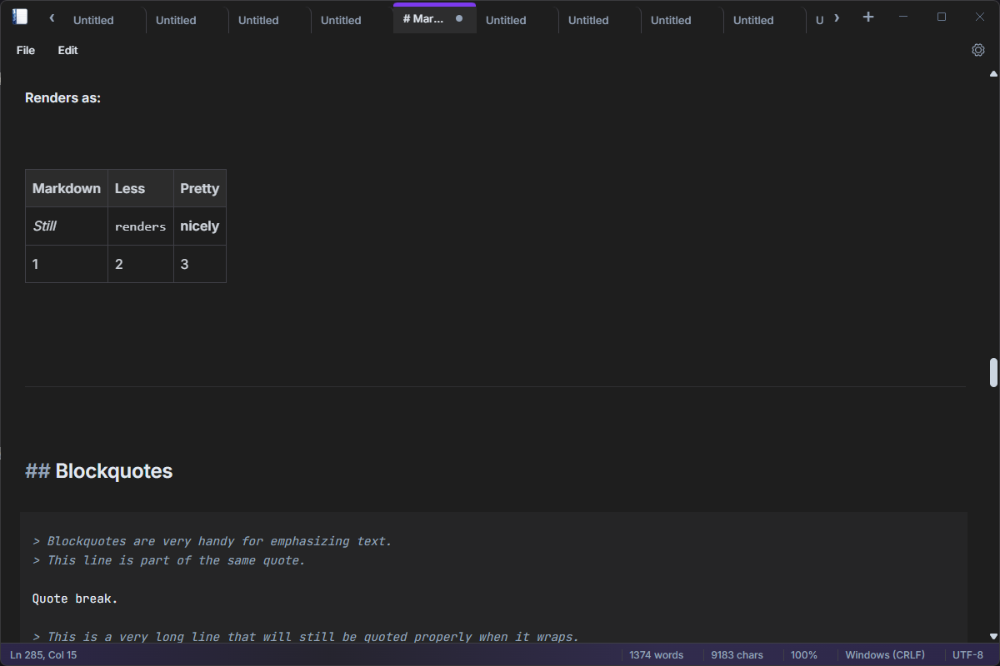
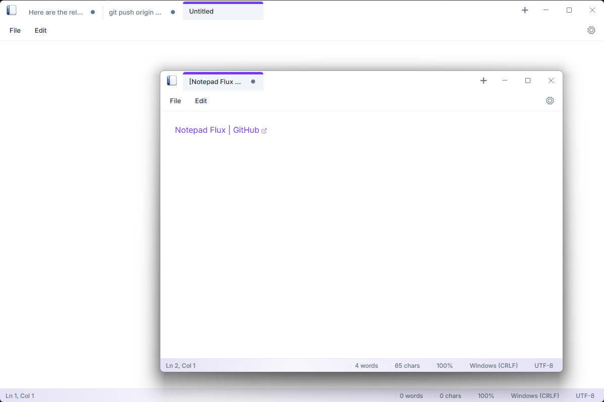

# Notepad Flux

A minimal, lightweight markdown writing application inspired by the simplicity of Windows Notepad, but with powerful modern features.

## Download (Windows & Linux)

I distribute Notepad Flux via GitHub Releases.

- Latest stable: https://github.com/yosr481/Notepad-Flux/releases/tag/v1.1.1

Downloads are available for:
- Windows (installer)
- Linux (AppImage or equivalent package)

After download, run the installer (Windows) or mark the file as executable and run it (Linux). No additional setup is required.

## Core Philosophy
The app is designed to be fast and distraction-free. It combines the simplicity of a plain text editor with the power of a WYSIWYG interface.

## Key Features
- **Live Preview Experience**: The core writing experience is built on **CodeMirror 6**, offering a "Live Preview" mode. Markdown syntax is hidden by default and revealed only when the cursor is active on the element, providing a clean, WYSIWYG-style reading and writing environment.
- **Minimalist UI**: Heavily inspired by Windows Notepad.
  - **Menus**: Classic File and Edit menus.
  - **Status Bar**: Simple information display.
  - **Tabs**: Support for multiple open files via a tabbed interface.
- **Theming**: Built-in support for both Dark and Light modes.

## Screenshots

> Note: The images below are referenced from `Docs/screenshots/`.



Small demo in Dark theme showing multiple tabs, status bar, and live-rendered Markdown (tables and blockquotes).



Light theme look-and-feel with a minimal canvas and multiple windows.


A distraction-free, blank canvas ready for writing in Dark mode.

## Technology Stack
- **Frontend**: React + Vite
- **Editor Engine**: CodeMirror 6
- **Current Status**: Stable desktop builds are available via Releases (see above). The web app can also be run locally for development.

# For Developers: Project Setup

Welcome to the **Notepad Flux** project! If you want to develop or contribute, follow these steps to get up and running locally.

## Prerequisites

- **Node.js**: Ensure you have Node.js installed. You can download it from [nodejs.org](https://nodejs.org/). Version 18+ is recommended.

## Installation

1.  **Open a terminal** in the project root directory.
2.  **Install dependencies** by running:
    ```bash
    npm install
    ```

## Running the Project (Web Dev Server)

1.  **Start the development server**:
    ```bash
    npm run dev
    ```
2.  Open your browser and navigate to the URL shown in the terminal (usually `http://localhost:5173`).

## Building for Production

To build the project for production:
```bash
npm run build
```

## Linting

To run the linter:
```bash
npm run lint
```

## Support and Feedback

- Found a bug or have a feature request? Please open an issue.
- Looking to contribute? See `CONTRIBUTING.md`.

## License
This project is licensed under the [MIT License](LICENSE).